# RzWeb

<p align="center">
  <a href="https://telegram.dog/rizinweb">
    
  </a>
</p>

RzWeb is a browser-based reverse engineering interface powered by Rizin compiled to WebAssembly. Drop a binary into the app and analyze it locally in your browser with a persistent session, terminal access, cached re-open support, and dedicated views for disassembly, decompilation, cross-references, control-flow graphs, and the rest of the main analysis surfaces. Rizin runs in a Web Worker, so heavy analysis never blocks the UI.

## Screenshots

**Homepage**

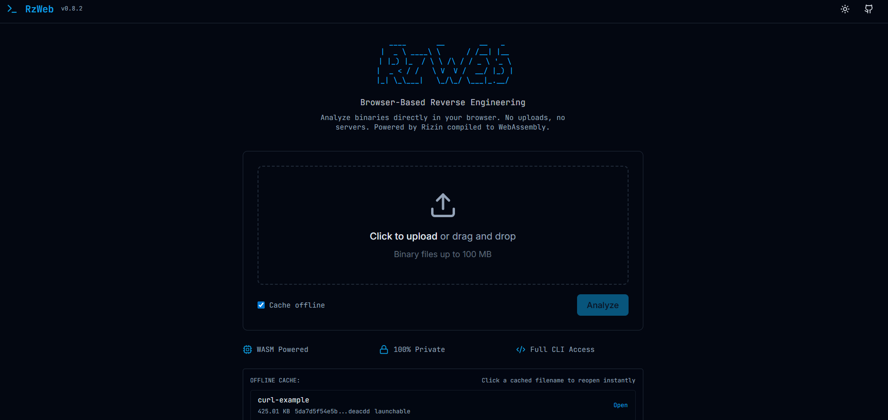

**Terminal**

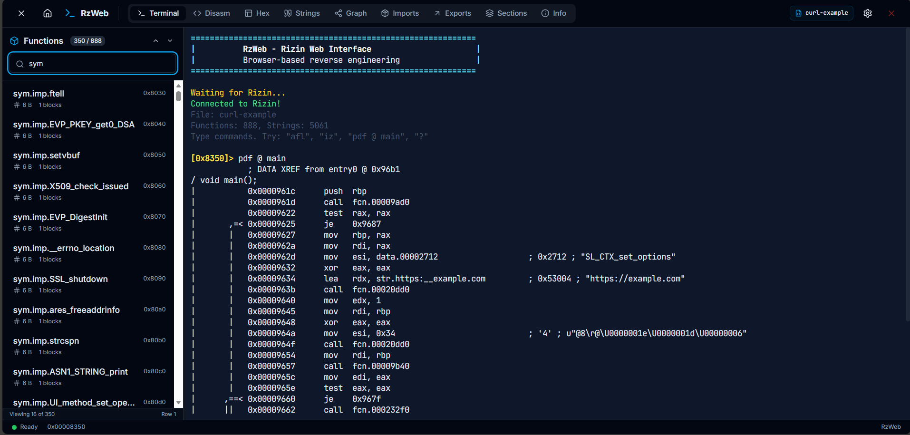

**Disassembly**

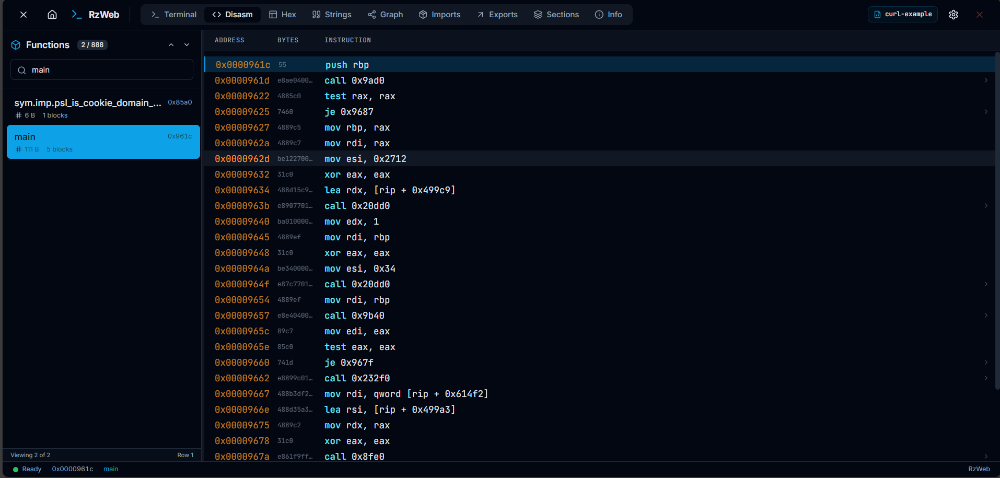

**Decompiler**

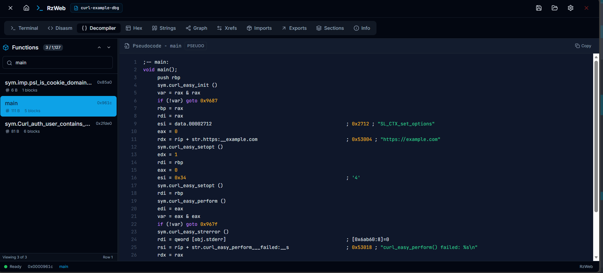

**Cross-references**

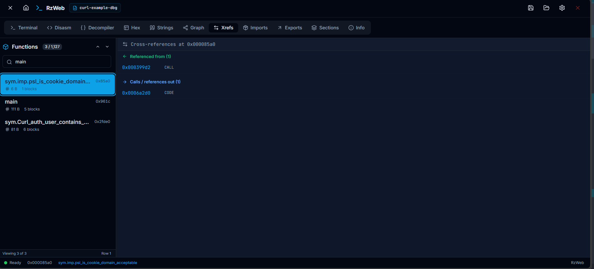

**Control Flow Graph**

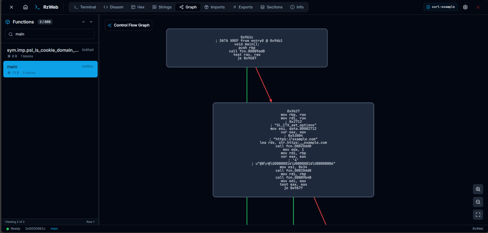

**Hex Dump**

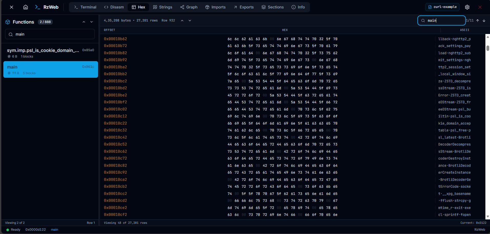

**Strings**

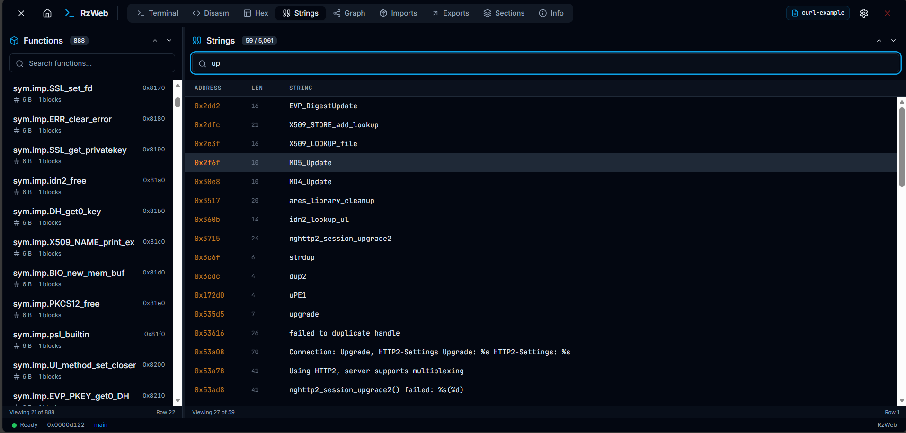

**Imports**

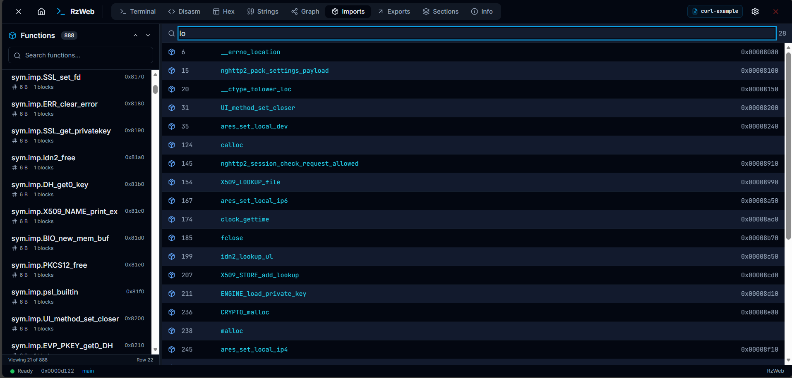

**Exports**

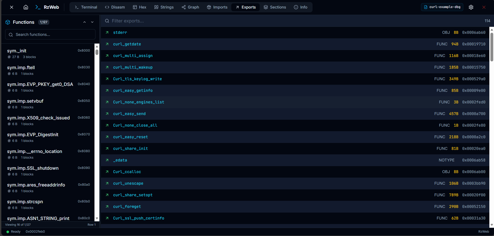

**Sections**

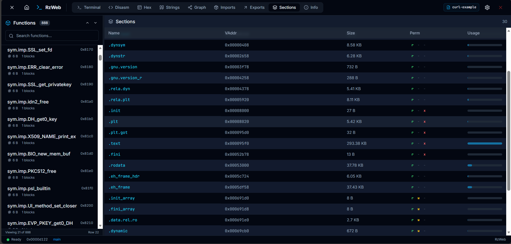

**Binary Info**

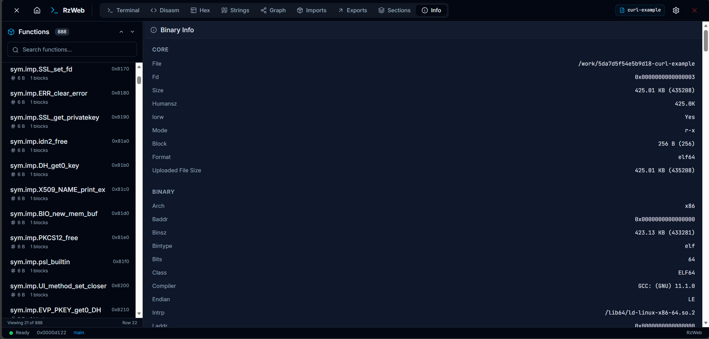

## Highlights

- Multi-session tabs: open several binaries at once, each in its own Web Worker, and switch between them with per-tab view state preserved.
- Persistent Rizin sessions through the paired `rzwasi` build, so analysis state, seeks, and follow-up commands stay live inside the same binary session.
- Rizin runs in a Web Worker, keeping the UI responsive during analysis, multi-MB JSON parsing, and persistence.
- Edit the binary in the browser like: patch bytes from the Hex view or terminal write commands and save the modified file at any time.
- Scripts panel with a CodeMirror editor (syntax highlighting, command-catalog autocomplete) that runs rizin cmd scripts and JS with a synchronous `rz` API, scripts can be uploaded, saved, and downloaded.
- Multiple themes with a picker, the terminal and control-flow graph track the active theme.
- Full terminal access with live command autocomplete, `Tab` completion, arrow-key selection, in-terminal find, and configurable minimum characters and max results returned.
- Dedicated views for disassembly, decompilation, cross-references, control-flow graphs, hex, strings, imports, exports, sections, and binary information.
- Built-in decompiler view (auto-detects the build's decompiler command, e.g. `pdg`/`pdc`) with C-style syntax highlighting and one-click copy.
- Cross-references panel showing who references the current address and where it points, with click-to-seek.
- Interactive control-flow graph: click a basic block to seek, current-block highlighting, and an automatic dagre layout.
- Command palette (`Ctrl`/`Cmd`+`K`) for fuzzy function and string search, `0x` address seeking, and running any Rizin command.
- Keyboard shortcuts for view switching (`Alt`+`1`..`9`), the palette, the sidebar, settings, and shortcut help.
- Save and reopen analysis sessions as self-contained `.rzdb` project files that embed the binary, so a saved project reopens cold in a single click without needing the original file; raw Rizin `.rzdb` files are also accepted when the matching binary is already open.
- Analysis caching keyed by binary hash, including direct reopen from the homepage when binary data is stored in the cache.
- Configurable command output limits and warning banners for oversized binaries or truncated metadata.
- Responsive layout tuned for both desktop and mobile usage.

## Supported Formats

RzWeb follows the formats supported by the bundled Rizin build, including:

- ELF
- PE / PE+
- Mach-O
- Raw firmware and byte dumps

## How It Works

1. Open the app.
2. Drop or pick a binary.
3. Analyze it with the configured depth.
4. Move between the terminal and structured views, or reopen the same cached binary later from the homepage.

Everything runs locally in the browser. Files stay on the device and are loaded into WebAssembly memory and browser storage only.

## Privacy

RzWeb does not upload binaries to a server. Analysis, caching, and reopening happen entirely in the browser via WebAssembly, IndexedDB, and the in-memory filesystem exposed by Emscripten.

## Browser Constraints

- Debugging features that require `ptrace` are unavailable in browser sandboxes.
- Analysis is still single-threaded WebAssembly work, so very large binaries can take time.
- Available functionality ultimately depends on the capabilities exported by the current `rzwasi` build.

## Building Locally

```bash
git clone https://github.com/IndAlok/rzweb
cd rzweb
npm install
npm run dev
```

## Architecture

The frontend uses React, TypeScript, Tailwind CSS, Zustand, xterm.js, and Cytoscape for graph rendering. The Rizin WebAssembly module runs inside a Web Worker that owns all native calls, filesystem access, JSON parsing, and IndexedDB persistence, the main thread talks to it through a typed RPC facade, so the UI never blocks on analysis. The reverse engineering core comes from the companion [rzwasi](https://github.com/IndAlok/rzwasi) repository, which builds Rizin to WebAssembly and exposes both the traditional CLI entrypoint and the persistent `rzweb_*` session API used by RzWeb.

## Community & Support

Questions, ideas, or need a hand? Join the chat:

<a href="https://telegram.dog/rizinweb">
  
</a>

## Credits

Built by [IndAlok](https://github.com/IndAlok)

Powered by [Rizin](https://rizin.re), the open-source Reverse Engineering framework.
