# RzWeb

<p align="center">
  <a href="https://telegram.dog/rizinweb">
    
  </a>
</p>

RzWeb is a browser-based reverse engineering interface powered by Rizin compiled to WebAssembly. Drop a binary into the app and analyze it locally in your browser with a persistent session, terminal access, cached re-open support, and dedicated views for disassembly, decompilation, cross-references, control-flow graphs, and the rest of the main analysis surfaces. Rizin runs in a Web Worker, so heavy analysis never blocks the UI.

## Screenshots

**Homepage**

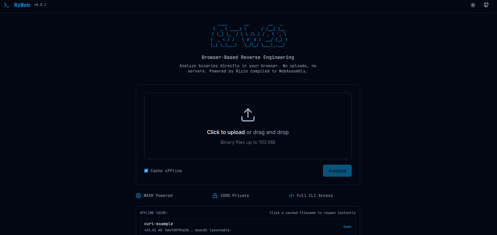

**Terminal**

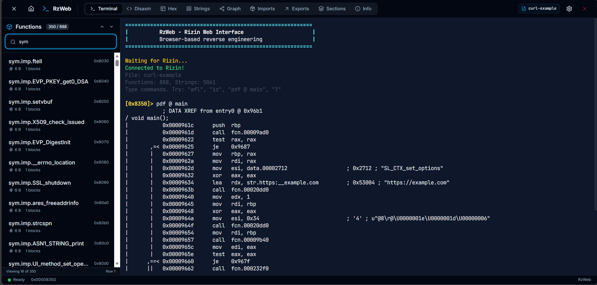

**Disassembly**

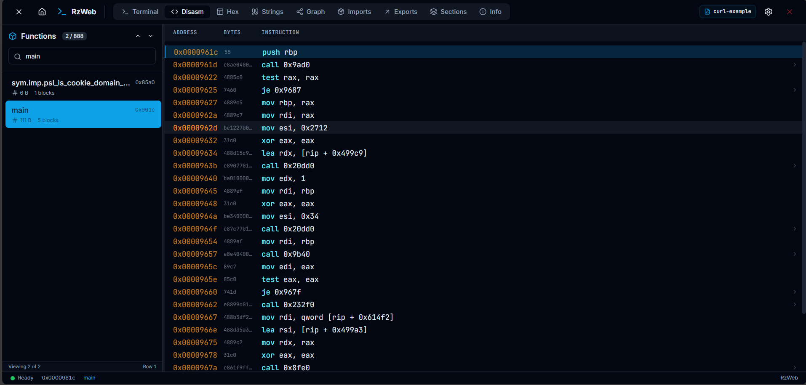

**Decompiler**

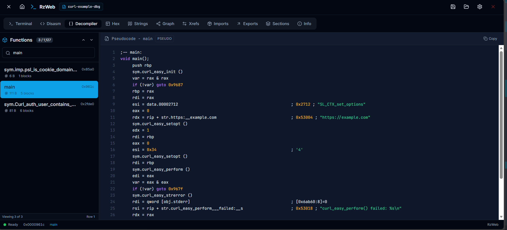

**Cross-references**

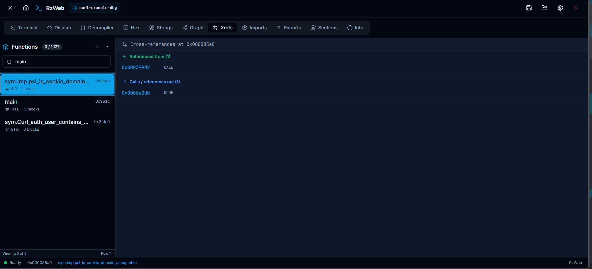

**Control Flow Graph**

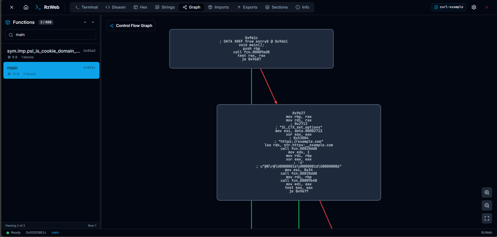

**Hex Dump**

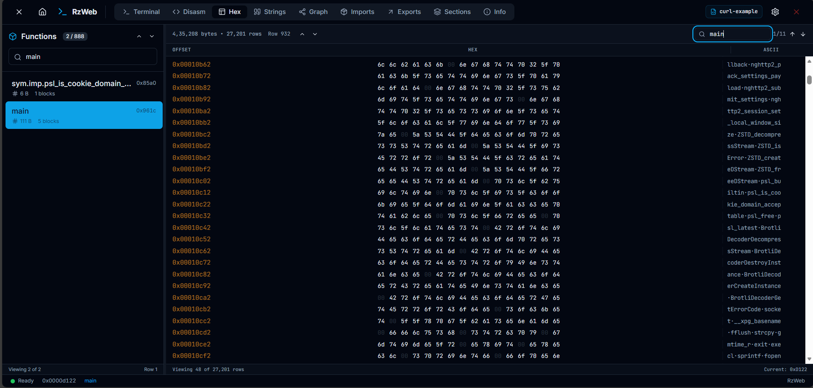

**Strings**

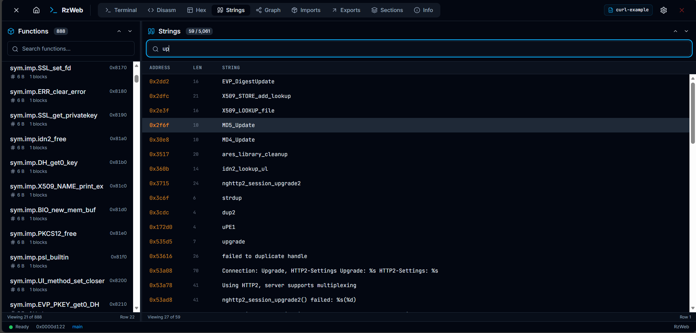

**Imports**

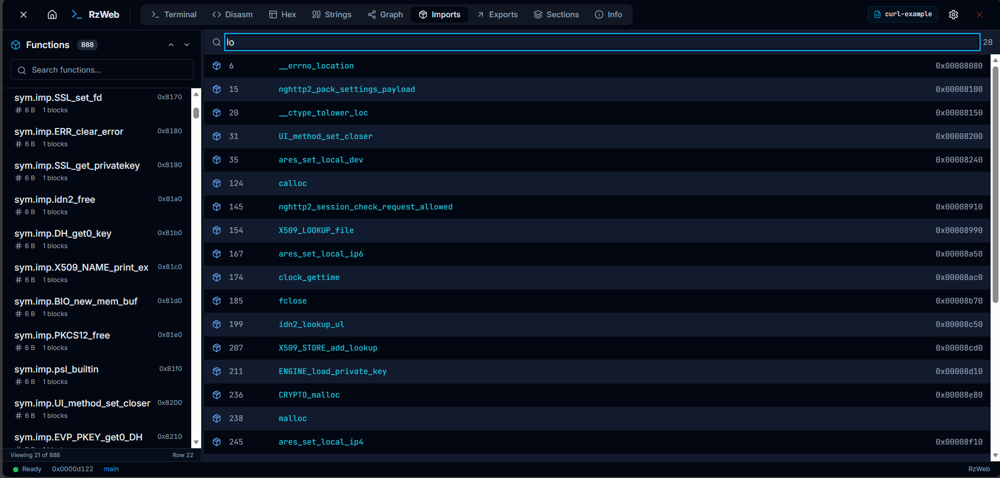

**Exports**

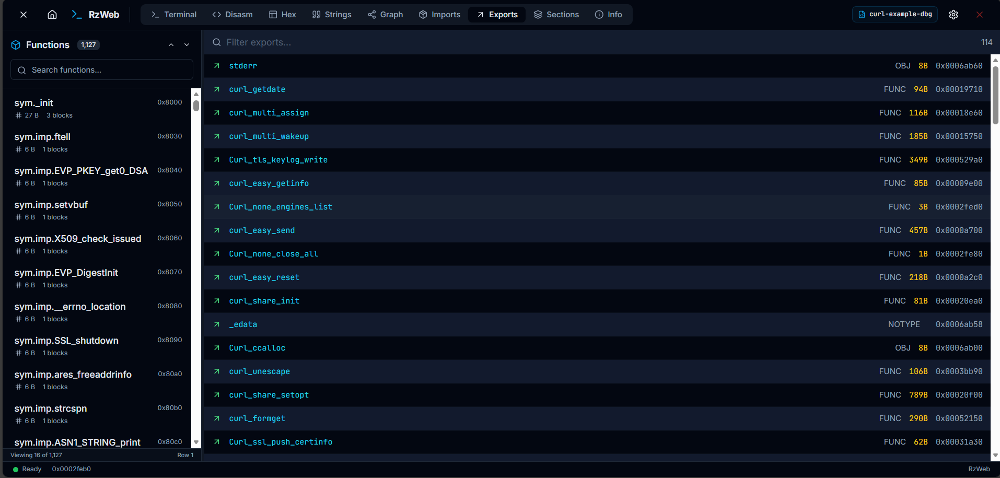

**Sections**

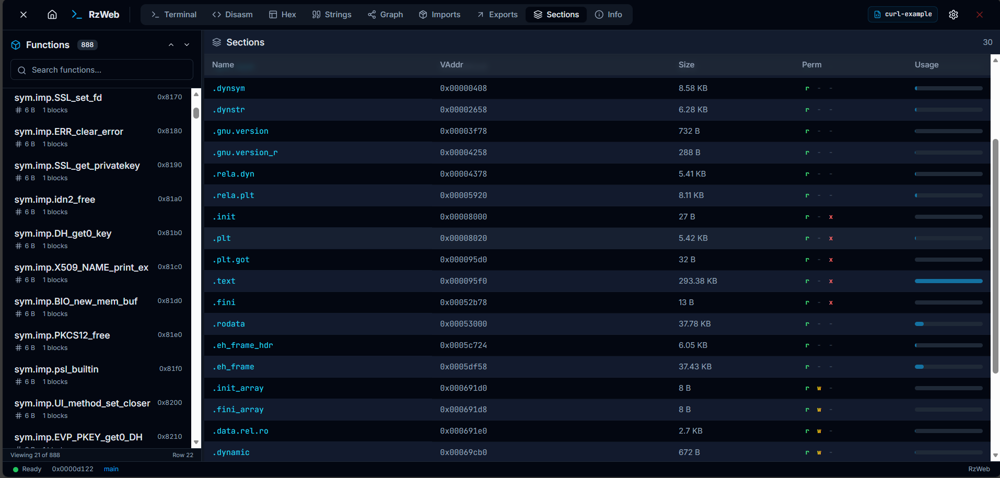

**Binary Info**

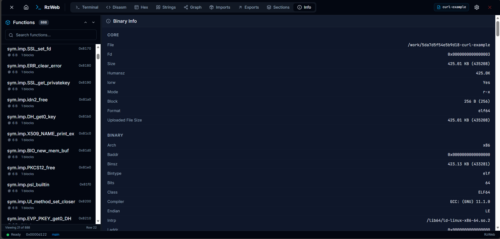

## Highlights

- Multi-session tabs: open several binaries at once, each in its own Web Worker. Switching tabs keeps that worker live. Closing a tab or going Home terminates it.
- Contexts: each binary session is a named workspace with artifact bytes, a current `.rzdb`, and a short revision history in IndexedDB. Home can resume or start a new context for the same hash.
- Persistent Rizin sessions through the paired `rzwasi` build, so analysis state, seeks, and follow-up commands stay live inside the same binary session.
- Rizin runs in a Web Worker, keeping the UI responsive during WASM load. Auto-analysis (`aaa`) still freezes that worker until the command returns. Cancel only works between staged commands.
- Edit the binary in the browser like: patch bytes from the Hex view or terminal write commands and save the modified file at any time.
- Scripts panel with a CodeMirror editor (syntax highlighting, command-catalog autocomplete) that runs rizin cmd scripts and JS with a synchronous `rz` API, scripts can be uploaded, saved, and downloaded.
- Multiple themes with a picker, the terminal and control-flow graph track the active theme.
- Full terminal access with live command autocomplete, `Tab` completion, arrow-key selection, in-terminal find, and configurable minimum characters and max results returned.
- Dedicated views for disassembly, decompilation, cross-references, control-flow graphs, hex, strings, imports, exports, sections, and binary information.
- Built-in decompiler view. It uses `pdg`, `pdd`, or `pdc` when the WASM build ships one, otherwise Rizin `pdf` with `asm.pseudo`. Stock hosted WASM has no jsdec or rz-ghidra.
- Cross-references panel showing who references the current address and where it points, with click-to-seek.
- Interactive control-flow graph: click a basic block to seek, current-block highlighting, and an automatic dagre layout.
- Command palette (`Ctrl`/`Cmd`+`K`) for fuzzy function and string search, `0x` address seeking, and running any Rizin command.
- Keyboard shortcuts for view switching (`Alt`+`1`..`9`), the palette, the sidebar, settings, and shortcut help.
- Save and reopen analysis sessions as self-contained `.rzdb` project files that embed the binary, so a saved project reopens cold in a single click without needing the original file. Raw Rizin `.rzdb` files are also accepted when the matching binary is already open.
- Analysis caching keyed by binary hash, migrated into the Context library on first run.
- Configurable command output limits and warning banners for oversized binaries or truncated metadata.
- Responsive layout tuned for both desktop and mobile usage.

## Supported Formats

RzWeb follows the formats supported by the bundled Rizin build, including:

- ELF
- PE / PE+
- Mach-O
- Raw firmware and byte dumps

## How It Works

1. Open the app.
2. Drop or pick a binary. If that hash already has a context, resume it or start a new one.
3. The analysis page opens after WASM and the file are mounted. Analysis then runs as a job on that tab's worker.
4. Snapshot or export `RZWEBPRJ` when you want a portable copy. History restores an older `.rzdb` onto the open file.

Local RzWeb keeps files on the device. They are loaded into WebAssembly memory and IndexedDB only.

## Privacy

The browser app does not upload binaries. Analysis, context history, and reopen happen on this machine via WebAssembly, IndexedDB, and Emscripten's in-memory filesystem.

Hosted MCP is a different product. That path stores artifacts and `.rzdb` files on the server you deploy (R2 plus a container). Treat it as an explicit upload of whatever you open, including malware samples. Do not point Cursor at a hosted URL if you need the local privacy claim.

Local MCP (`mcp/` in this repo) uses the same `rizin.wasm` on your disk under `~/.rzweb/contexts`. Nothing leaves the machine unless you configure it otherwise.

## Browser Constraints

- Debugging features that require `ptrace` are unavailable in browser sandboxes.
- Each live context is one worker and one `RzCore`. Analysis is single-threaded WebAssembly work. Very large binaries take time, and that worker cannot run other commands until `aaa` returns.
- Cancel stops the job between stages (`aa` then `aaa`/`aaaa`). There is no mid-command interrupt in the stock build.
- Stock `rzwasi` WASM has no Ghidra plugin. jsdec is an opt-in rzwasi build, pointed at with `VITE_WASM_BASE_URL`.
- Restore of a saved project needs `rzweb_apply_project` in the WASM you load. Older dist builds fall back to path-based `Po` and show a notice. Rebuild rzwasi and publish, or set `VITE_WASM_BASE_URL`, before relying on Context restore.
- Available functionality ultimately depends on the capabilities exported by the current `rzwasi` build.

## Manual checks

Vitest cannot run `rizin.wasm`. After a WASM publish, confirm:

- Two tabs: rename a function in A, switch to B and back, the rename is still in A's live core.
- Cold `RZWEBPRJ` open from Home.
- Restore an older snapshot from Context history.
- Depth 2 job banner, and cancel between `aa` and `aaa`.
- Missing `rzweb_apply_project` shows the apply-project notice.

## Building Locally

```bash
git clone https://github.com/IndAlok/rzweb
cd rzweb
npm install
npm run dev
```

## Architecture

The frontend uses React, TypeScript, Tailwind CSS, Zustand, xterm.js, and Cytoscape for graph rendering. Each live Context owns a Web Worker that loads `rizin.wasm`, queues RPCs, and persists revisions. The main thread talks to it through a typed RPC facade. The reverse engineering core comes from the companion [rzwasi](https://github.com/IndAlok/rzwasi) repository, which builds Rizin to WebAssembly and exports `rzweb_apply_project` so a `.rzdb` can be applied onto an already-open file.

Local MCP lives in `mcp/`. Hosted MCP lives in `hosted/` and is an explicit upload path.

## Community & Support

Questions, ideas, or need a hand? Join the chat:

<a href="https://telegram.dog/rizinweb">
  
</a>

## Credits

Built by [IndAlok](https://github.com/IndAlok)

Powered by [Rizin](https://rizin.re), the open-source Reverse Engineering framework.
